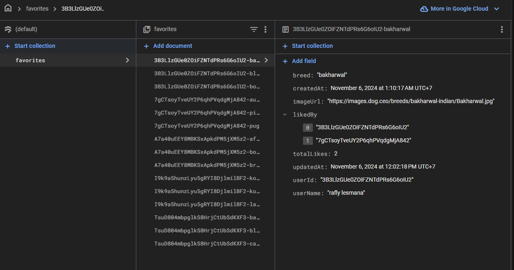

# Dog Breeds React Project

<video controls src="demo.mp4" title="Title"></video>
You can view a live demo of the application at https://dog-breeds-2d28a.web.app.


## Table of Contents

- [Introduction](#introduction)
- [Technologies Used](#technologies-used)
- [Getting Started](#getting-started)
- [Favourites Collection](#firestore-collection)
- [Security](#security)
- [Refactoring with Node.js Firebase Function](#refactoring)
- [Unit Test Approach](#unit-test-approach)


## Introduction

This project is a React application that provides information about different dog breeds. It features:

- **Breed Information:** Detailed descriptions of various dog breeds, including their physical characteristics, temperament, and unique traits.
- **Breed Images:** A gallery of images for each breed, allowing users to visualize their appearance.
- **Favorite Breeds:** Users can save their favorite breeds to a personalized list.
- **Games:** Interactive games related to dog breeds, such as a breed guessing game. (Coming soon)

## Technologies Used
- **React:** JavaScript library for building user interfaces.
- **Node.js (v18):** JavaScript runtime environment for server-side development.
- **npm (v10):** Package manager for Node.js.
- **Tailwind CSS:** Utility-first CSS framework for styling.
- **Firebase:** Backend services for authentication, database, and storage.
- **@tanstack/react-router:** Routing library for navigation.
- **@google/generative-ai:** Library for using Gemini AI models to generate detailed breed information.
- **shadcn:** UI components library for building beautiful and accessible user interfaces.


## Getting Started

1. **Clone the repository:**
   ```bash
   git clone https://RaflyLesmana3003/dog-breeds.git
   ```

2. **Navigate to the project directory:**
   ```bash
   cd dog-breeds
   ```

3. **Install dependencies:**
   ```bash
   npm install
   ```

4. **Start the development server:**
   ```bash
   npm run dev
   ```

## Firestore collection

**Favourites Collection:**


| Field | Data Type | Description |
|---|---|---|
| `breed` | String | The name of the dog breed. |
| `imageUrl` | String | The URL of the breed's image. |
| `id` | String | The unique ID of the document. |
| `userId` | String | The user's ID who added the favourites. |
| `userName` | String | The user's display name. |
| `totalLikes` | Number | The total number of likes the breed has received. |
| `createdAt` | Timestamp | The timestamp when the favourites was added. |
| `updatedAt` | Timestamp | The timestamp when the favourites was last updated. |
| `likedBy` | Array of Strings | An array of user IDs who have liked the breed. |

**Example Document:**

```json
{
  "breed": "Golden Retriever",
  "imageUrl": "https://images.dog.ceo/breeds/goldenretriever/n02099712_1003.jpg",
  "id": "some-unique-id",
  "userId": "user123",
  "userName": "John Doe",
  "totalLikes": 10,
  "createdAt": "2023-10-26T10:00:00.000Z",
  "updatedAt": "2023-10-26T10:00:00.000Z",
  "likedBy": ["user123", "user456"]
}
```

## Security

The solution is secure because:
- **Authentication:** Users must be authenticated before they can add favorites or like breeds. This prevents unauthorized access to user data.
- **Firestore Security Rules:** Firestore security rules can be implemented to restrict access to data based on user roles or permissions. For example, only authenticated users can read and write to the `favorites` collection.
- **Data Validation:** Data validation can be implemented to ensure that only valid data is stored in the database. For example, the `breed` field can be validated to ensure that it is a valid dog breed.

## Refactoring

**Refactoring Approach:**

To refactor the code and ensure that only the service directory needs to be changed, we can follow this approach:

**Refactoring with Node.js Firebase Function:**

To refactor the solution to include a Node.js Firebase function that connects to the `dog.ceo` API endpoint and fattens the data into a single array of strings, we can follow these steps:

1. **Create a Firebase Function:** Create a new Firebase function in the `functions` directory. This function will be responsible for fetching the data from the `dog.ceo` API and transforming it into a single array of strings.

2. **Implement the Function:** In the Firebase function, implement the following:
   - **API Request:** Make a request to the `dog.ceo` API endpoint to retrieve the list of all dog breeds.
   - **Data Parsing:** Parse the response from the API and transform it into a single array of strings, where each string represents a dog breed.
   - **Error Handling:** Handle potential errors during the API request or data parsing.
   - **Data Storage:** Store the resulting array of strings in a Firestore collection.

3. **Deploy the Function:** Deploy the Firebase function to your Firebase project.

4. **Utilize the Function:** In your React application, use the Firebase function to retrieve the list of dog breeds from the Firestore collection.

**Considerations:**

- **Security:** Ensure that the Firebase function is properly secured to prevent unauthorized access.
- **Scalability:** Consider the scalability of the Firebase function and the Firestore collection.
- **Caching:** Implement caching to reduce the number of API requests and improve performance.
- **Error Handling:** Implement robust error handling to ensure that the function is resilient to errors.
- **Server-Side Pagination:** Implement server-side pagination to handle large datasets efficiently. This involves fetching only a subset of data at a time, based on the current page or offset.

**Notes:**

- **Centralized Logic:** All the logic related to fetching and parsing dog breeds is centralized in the `src/services` directory.
- **Maintainability:** Changes to the API request or data parsing logic only require modifications within the `src/services` directory.
- **Reusability:** The service can be reused in multiple components or routes without duplicating code.


## Unit Test Approach

**Example Unit Test:**

```javascript
import { getBreeds } from './getBreeds'; 
describe('getBreeds', () => {
  it('should return an array of dog breeds', async () => {
    const breeds = await getBreeds();
    expect(breeds).toBeInstanceOf(Array);
    expect(breeds.length).toBeGreaterThan(0);
    expect(breeds[0]).toBeTypeOf('string');
  });
});
```

**Parts of the Code to Test:**

- **API Request:** Verify that the function makes a request to the correct API endpoint.
- **Data Parsing:** Ensure that the response from the API is parsed correctly and transformed into a single array of strings.
- **Error Handling:** Test the function's ability to handle errors during the API request or data parsing.
